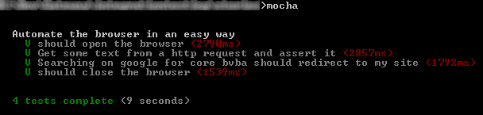

# Story - automate the browser in an easy way

Forget all async, nodejs and other stuff; simply write tests, that's it!

** VERY EARLY ALPHA - use at your own risk**

## Example

    story = require "./story"
    system = require "./system"

    story "Automate the browser in an easy way",
      
      "Get some text from a http request and assert it": (browser) ->
      
        browser.get system.html.url
        text = browser.elementByCss(system.html.heading.selector).text()
        text.should.include system.html.heading.expectedText
        
        
      "Searching on google for core bvba should redirect to my site": (browser) ->
      
        browser.get system.search.url
        browser.submit system.search.data
        browser.setWaitTimeout 3*1000
        text = browser.elementByCss(system.searchResults.titles.selector).text()
        text.should.equal system.searchResults.titles.expectedText

## How to run

Make sure you have all the required prerequisites in you path (I use chocolatey on windows):

- nodejs
- npm

Download the code or clone the repo using

    git clone git://github.com/ToJans/story.git

and then run

    npm install

First you need to start selenium (only do this once):
use

     runselenium.cmd

or

    java -jar tools\selenium-server-standalone-2.31.0.jar -Dwebdriver.chrome.driver=tools\chromedriver.exe

Then run the `.coffee` and `.js` test files in your `./test` subfolder 

    npm test

This should be the output you receive after you see some voodoo magic happening in the browser (Chrome required):

    
## Available commands for the browser

To know which commands are available on the browser object, look [here](https://github.com/sebv/node-wd-sync).

All commands run synchronously, no need to teach your testers async stuff.

There is one extra command on the browser named `submit` that allows you to submit a form. It uses `browser.elementByName` based on the keys; take a look at the example.

## Dependencies

- node.js
- coffee-script
- selenium
- webdriver
- wd-sync    
    
## TODO

- clean up package
- publish on npm
- polish my coffeescript n00b code
- blog about it
- A lot more later!!
